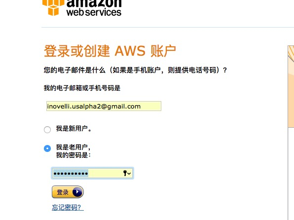
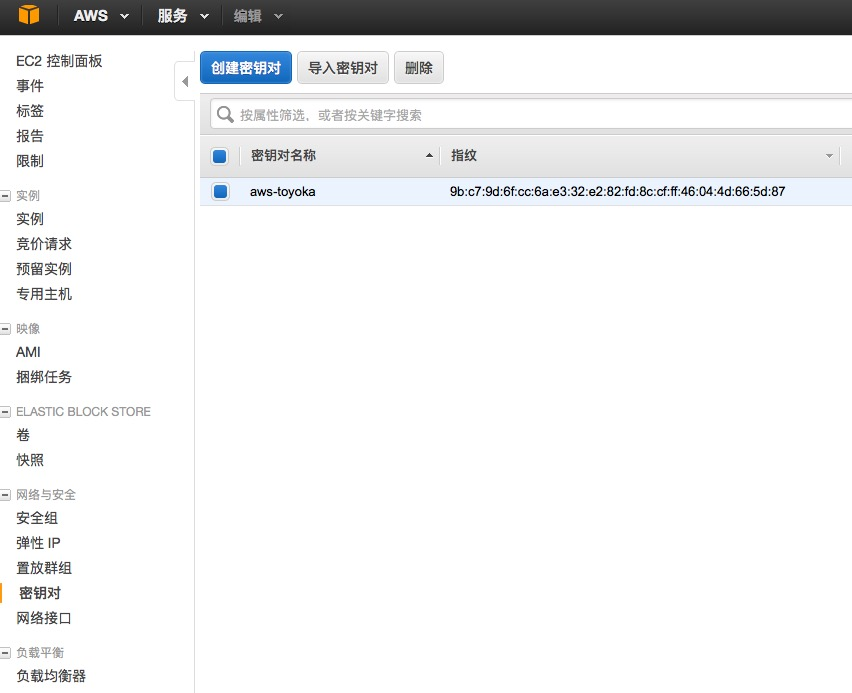
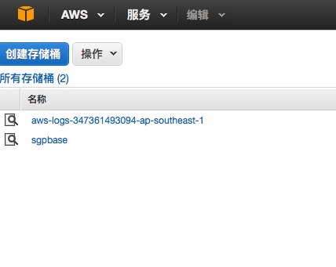
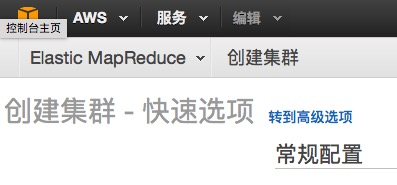
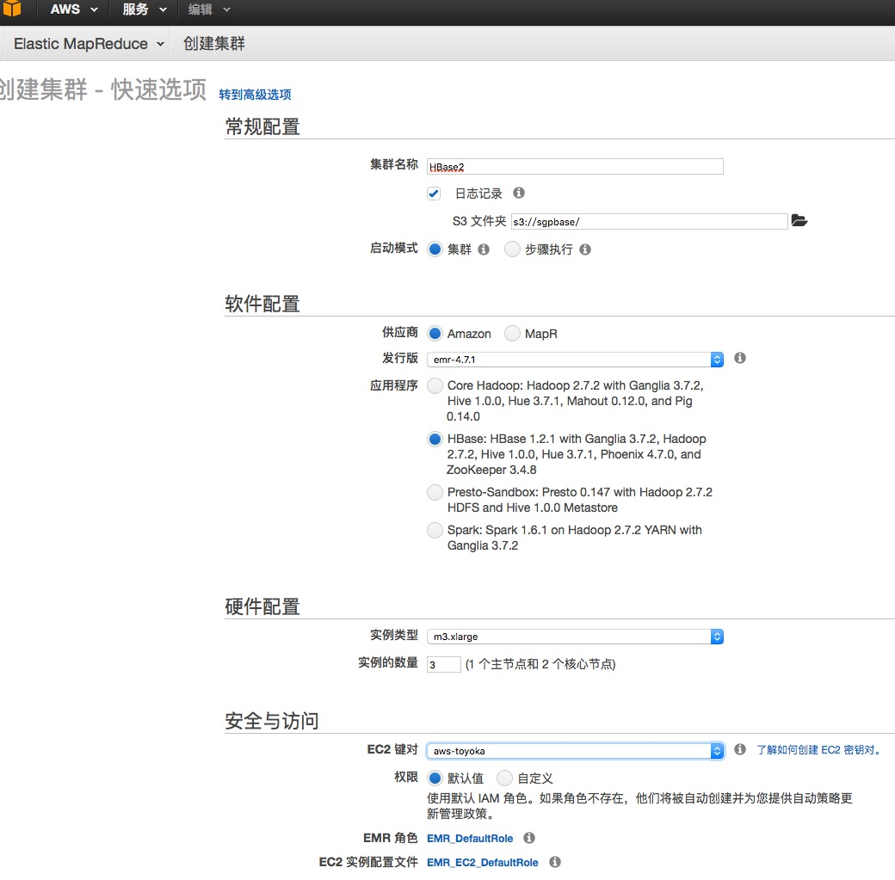

AWS EMR上搭建HBase环境

# 概述

AWS的EMR服务为客户提供的托管 Hadoop 框架可以让您快 
速高效地在多个动态可扩展的 Amazon EC2 实例之间分发和处理 
大数据,尤其是 Hbase 的配置，但是自己开 EC2 的实例安装 Hbase 有环境的配置比较复杂，所以，此次还是使用 AWS 的hadoop集群。

以运行常用的分发框架（例如 Amazon EMR 中的 
Spark 和 Presto）与其他 AWS 数据存储服务（例如 Amazon S3 和  
靠地处理大数据使用案例，包括日志分析、Web 索引、数据仓库、机器 
学习、财务分析、科学模拟和生物信息。 
通过EMR服务，我们不必再去手动一个个的安装JDK,Hadoop, 
不用再为安装这些软件费神，搭建过Hadoop集群的很繁琐， 
还有很多配置，甚至每台机器上遇到的问题还不一样。现在通过EMR一切 
都变得简单，使开发能专注于自己的开发，现在说起来简单，但我在用EMR的 
时候也遇到了很多问题，由于众所周知的原因AWS在朝鲜和其他国家并 
不能方便的应用，尤其EMR，所以我能找到的关于EMR的资料没有帮我 
完全搞定，官方的文档很多，但有的问题没有说清楚，在AWS进行实际的技术测试后才完全搞定。

# 创建密钥对

密钥对是用来ssh登录远程主机的 ，这个密钥对是按区域创建，并且不能跨区使用的。如果在不同的区建立 EMR，则需要在同一个区建立密钥对。只需要建立一次，可以重复使用。

1.  打开 Amazon EC2 控制台 https://console.aws.amazon.com/ec2/。
 
2. 左侧找到密钥对 
 
3. 创建密钥对 
点击创建后会弹出对话框让你保存密钥，保存好，ssh登录的时候会用到 

# 创建S3存储桶

如果此步忽略，后面会默认创建一个存储桶 

1. 通过以下网址打开 Amazon S3 控制台：https://console.aws.amazon.com/s3/。 
2. 创建存储桶 
 

# 创建EMR,托管Hadoop集群

1. 通过以下网址打开 Amazon EMR 控制台：https://console.aws.amazon.com/elasticmapreduce/。 
 
2. 创建集群 
输入集群名称，设置S3存储路径，即为第二步里创建的S3存储桶，如果没有创建，这里会自动分配一个路径 
    - 选择Hbase 
    - 设置集群数量，默认即可,至少是三个 Nodes
    - 选择密钥对，就是在第一步里创建的密钥对，然后点击创建，则开始启动集群，知道集群状态显示为等待状态时说明启动成功 
 

这样Hadoop集群就创建好了，在集群列表里点击刚才创建好的集群，进行集群详细信息 

# 登陆主机

根据官方文档，就是让你直接用主节点共有DNS和密钥对登陆，但是它没有说明要设置安全组，于是我在这个地方折腾了很久 

1. 修改安全策略 
AWS为了安全，默认的安全组里禁用了SSH的22端口，也禁用ping，总之你要用到的端口都必须自己去打开，我为了省事，因为是测试，所以全部打开了端口，具体操作如下： 
    - 在集群详细信息里，找到主机点的安全组，点击后面的连接进入安全组设置 
    - 点击入站，这里就是所有开放的端口，这里可以设置具体哪个IP访问，点击编辑，新增你的安全规则 
    - 打开ICMP是为了能ping同主机，打开SSH 22端口是为了SSH登录，也是为什么创建好主机直接登录不成功的原因所在，
    - 因为我要用程序通过thrift服务器来连接HBase所以打开TCP的端口，为安全起见，建议用到什么端口就打开什么端口

2 登录 
PuTTY 本身不支持 Amazon EC2 生成的私有密钥格式 (.pem)。PuTTY 有一个名为 PuTTYgen 的工具，可将密钥转换成所需的 PuTTY 格式 (.ppk)。您必须将私有密钥转换为此格式 (.ppk)，然后才能尝试使用 PuTTY 连接到您的实例。 

    # 转换您的私有密钥 
        - 启动 PuTTYgen（例如，在“Start”菜单中，依次单击“All Programs > PuTTY > PuTTYgen ”）。 
        - 在 Type of key to generate (要生成的密钥类型) 下，选择 SSH-2 RSA。 
        - 单击“Load”。在默认情况下，PuTTYgen 仅显示扩展名为 .ppk 的文件。要找到您的 .pem 文件，请选 择显示所有类型的文件的选项。 
        - 为启动实例时指定的密钥对选择 .pem 文件，然后单击 Open。单击 OK (确定) 关闭确认对话框。 
        - 单击 Save private key (保存私有密钥)，以 PuTTY 可用的格式保存密钥。PuTTYgen 显示一条关于在没有口令的情况下保存密钥的警告。单击 Yes (是)。

然后通过生成的ppk密钥来登录 

# 登录成功： 
则说明安装成功，可以通过 Hadoop 的功能对数据进行存储和分析了。

 - 输入hbase shell即可操作hbase 
 - EMR默认已经开启thrift，所以不再手动去启动它，这样程序里就可以访问主机了 
 - 用程序连接的时候可以用主机公共DNS名称连接即可。